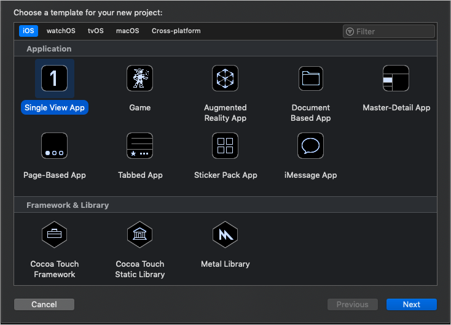
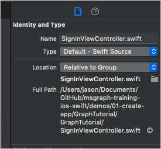
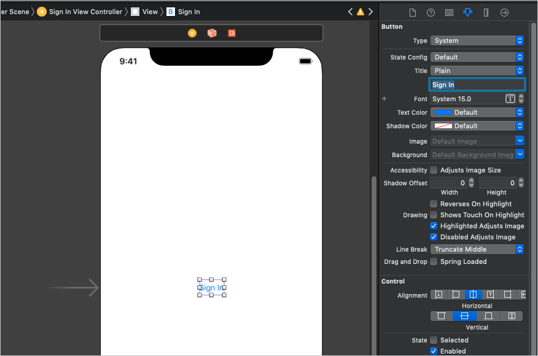
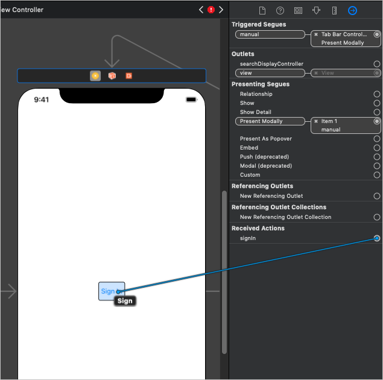
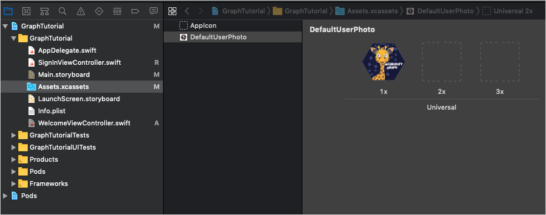

<!-- markdownlint-disable MD002 MD041 -->

<span data-ttu-id="bf033-101">Commencez par créer un projet SWIFT.</span><span class="sxs-lookup"><span data-stu-id="bf033-101">Begin by creating a new Swift project.</span></span>

1. <span data-ttu-id="bf033-102">Ouvrez Xcode.</span><span class="sxs-lookup"><span data-stu-id="bf033-102">Open Xcode.</span></span> <span data-ttu-id="bf033-103">Dans le menu **fichier** , sélectionnez **nouveau**, puis **projet**.</span><span class="sxs-lookup"><span data-stu-id="bf033-103">On the **File** menu, select **New**, then **Project**.</span></span>
1. <span data-ttu-id="bf033-104">Choisissez le modèle d' **application vue unique** , puis sélectionnez **suivant**.</span><span class="sxs-lookup"><span data-stu-id="bf033-104">Choose the **Single View App** template and select **Next**.</span></span>

    

1. <span data-ttu-id="bf033-106">Définissez le **nom** du produit `GraphTutorial` sur et la **langue** sur **SWIFT**.</span><span class="sxs-lookup"><span data-stu-id="bf033-106">Set the **Product Name** to `GraphTutorial` and the **Language** to **Swift**.</span></span>
1. <span data-ttu-id="bf033-107">Renseignez les champs restants, puis cliquez sur **suivant**.</span><span class="sxs-lookup"><span data-stu-id="bf033-107">Fill in the remaining fields and select **Next**.</span></span>
1. <span data-ttu-id="bf033-108">Choisissez un emplacement pour le projet et sélectionnez **créer**.</span><span class="sxs-lookup"><span data-stu-id="bf033-108">Choose a location for the project and select **Create**.</span></span>

## <a name="install-dependencies"></a><span data-ttu-id="bf033-109">Installer les dépendances</span><span class="sxs-lookup"><span data-stu-id="bf033-109">Install dependencies</span></span>

<span data-ttu-id="bf033-110">Avant de poursuivre, installez des dépendances supplémentaires que vous utiliserez plus tard.</span><span class="sxs-lookup"><span data-stu-id="bf033-110">Before moving on, install some additional dependencies that you will use later.</span></span>

- <span data-ttu-id="bf033-111">[Bibliothèque d’authentification Microsoft (MSAL) pour iOS](https://github.com/AzureAD/microsoft-authentication-library-for-objc) pour l’authentification auprès d’Azure ad.</span><span class="sxs-lookup"><span data-stu-id="bf033-111">[Microsoft Authentication Library (MSAL) for iOS](https://github.com/AzureAD/microsoft-authentication-library-for-objc) for authenticating to with Azure AD.</span></span>
- <span data-ttu-id="bf033-112">[Fournisseur d’authentification MSAL pour l’objectif C](https://github.com/microsoftgraph/msgraph-sdk-objc-auth) permettant de connecter MSAL avec le kit de développement logiciel (SDK) Microsoft Graph.</span><span class="sxs-lookup"><span data-stu-id="bf033-112">[MSAL Authentication Provider for Objective C](https://github.com/microsoftgraph/msgraph-sdk-objc-auth) to connect MSAL with the Microsoft Graph SDK.</span></span>
- <span data-ttu-id="bf033-113">[Kit de développement logiciel (SDK) Microsoft Graph pour objective C](https://github.com/microsoftgraph/msgraph-sdk-objc) pour les appels à Microsoft Graph.</span><span class="sxs-lookup"><span data-stu-id="bf033-113">[Microsoft Graph SDK for Objective C](https://github.com/microsoftgraph/msgraph-sdk-objc) for making calls to Microsoft Graph.</span></span>
- <span data-ttu-id="bf033-114">[Kit de développement logiciel (SDK) des modèles Microsoft Graph pour objective C](https://github.com/microsoftgraph/msgraph-sdk-objc-models) pour les objets fortement typés représentant des ressources Microsoft Graph, comme des utilisateurs ou des événements.</span><span class="sxs-lookup"><span data-stu-id="bf033-114">[Microsoft Graph Models SDK for Objective C](https://github.com/microsoftgraph/msgraph-sdk-objc-models) for strongly-typed objects representing Microsoft Graph resources like users or events.</span></span>

1. <span data-ttu-id="bf033-115">Quittez Xcode.</span><span class="sxs-lookup"><span data-stu-id="bf033-115">Quit Xcode.</span></span>
1. <span data-ttu-id="bf033-116">Ouvrez terminal et modifiez le répertoire à l’emplacement de votre projet **GraphTutorial** .</span><span class="sxs-lookup"><span data-stu-id="bf033-116">Open Terminal and change the directory to the location of your **GraphTutorial** project.</span></span>
1. <span data-ttu-id="bf033-117">Exécutez la commande suivante pour créer un Podfile.</span><span class="sxs-lookup"><span data-stu-id="bf033-117">Run the following command to create a Podfile.</span></span>

    ```Shell
    pod init
    ```

1. <span data-ttu-id="bf033-118">Ouvrez le Podfile et ajoutez les lignes suivantes juste après la `use_frameworks!` ligne.</span><span class="sxs-lookup"><span data-stu-id="bf033-118">Open the Podfile and add the following lines just after the `use_frameworks!` line.</span></span>

    ```Ruby
    pod 'MSAL', '~> 0.3.0'
    pod 'MSGraphMSALAuthProvider', '~> 0.1.1'
    pod 'MSGraphClientSDK', ' ~> 0.1.3'
    pod 'MSGraphClientModels', '~> 0.1.1'
    ```

1. <span data-ttu-id="bf033-119">Enregistrez le Podfile, puis exécutez la commande suivante pour installer les dépendances.</span><span class="sxs-lookup"><span data-stu-id="bf033-119">Save the Podfile, then run the following command to install the dependencies.</span></span>

    ```Shell
    pod install
    ```

1. <span data-ttu-id="bf033-120">Une fois la commande exécutée, ouvrez le **GraphTutorial. xcworkspace** nouvellement créé dans Xcode.</span><span class="sxs-lookup"><span data-stu-id="bf033-120">Once the command completes, open the newly created **GraphTutorial.xcworkspace** in Xcode.</span></span>

## <a name="design-the-app"></a><span data-ttu-id="bf033-121">Concevoir l’application</span><span class="sxs-lookup"><span data-stu-id="bf033-121">Design the app</span></span>

<span data-ttu-id="bf033-122">Dans cette section, vous allez créer les affichages de l’application : une page de connexion, un navigateur de barre d’onglets, une page d’accueil et une page de calendrier.</span><span class="sxs-lookup"><span data-stu-id="bf033-122">In this section you will create the views for the app: a sign in page, a tab bar navigator, a welcome page, and a calendar page.</span></span> <span data-ttu-id="bf033-123">Vous allez également créer une superposition des indicateurs d’activité.</span><span class="sxs-lookup"><span data-stu-id="bf033-123">You'll also create an activity indicator overlay.</span></span>

### <a name="create-sign-in-page"></a><span data-ttu-id="bf033-124">Créer une page de connexion</span><span class="sxs-lookup"><span data-stu-id="bf033-124">Create sign in page</span></span>

1. <span data-ttu-id="bf033-125">Développez le dossier **GraphTutorial** dans Xcode, puis sélectionnez **ViewController. Swift**.</span><span class="sxs-lookup"><span data-stu-id="bf033-125">Expand the **GraphTutorial** folder in Xcode, then select **ViewController.swift**.</span></span>
1. <span data-ttu-id="bf033-126">Dans l' **inspecteur de fichiers**, remplacez le **nom** du fichier par `SignInViewController.swift`.</span><span class="sxs-lookup"><span data-stu-id="bf033-126">In the **File Inspector**, change the **Name** of the file to `SignInViewController.swift`.</span></span>

    

1. <span data-ttu-id="bf033-128">Ouvrez **SignInViewController. Swift** et remplacez son contenu par le code suivant.</span><span class="sxs-lookup"><span data-stu-id="bf033-128">Open **SignInViewController.swift** and replace its contents with the following code.</span></span>

    ```Swift
    import UIKit

    class SignInViewController: UIViewController {

        override func viewDidLoad() {
            super.viewDidLoad()
            // Do any additional setup after loading the view.
        }

        @IBAction func signIn() {
            self.performSegue(withIdentifier: "userSignedIn", sender: nil)
        }
    }
    ```

1. <span data-ttu-id="bf033-129">Ouvrez le fichier **principal. Storyboard** .</span><span class="sxs-lookup"><span data-stu-id="bf033-129">Open the **Main.storyboard** file.</span></span>
1. <span data-ttu-id="bf033-130">Développez **View Controller Scene**, puis sélectionnez **View Controller**.</span><span class="sxs-lookup"><span data-stu-id="bf033-130">Expand **View Controller Scene**, then select **View Controller**.</span></span>

    

1. <span data-ttu-id="bf033-132">Sélectionnez l' **inspecteur d’identité**, puis définissez la liste déroulante de **classe** sur **SignInViewController**.</span><span class="sxs-lookup"><span data-stu-id="bf033-132">Select the **Identity Inspector**, then change the **Class** dropdown to **SignInViewController**.</span></span>

    

1. <span data-ttu-id="bf033-134">Sélectionnez la **bibliothèque**, puis faites glisser un **bouton** sur le **contrôleur de vue de connexion**.</span><span class="sxs-lookup"><span data-stu-id="bf033-134">Select the **Library**, then drag a **Button** onto the **Sign In View Controller**.</span></span>

    

1. <span data-ttu-id="bf033-136">Lorsque le bouton est sélectionné, sélectionnez l' **inspecteur d’attributs** et remplacez le **titre** du bouton `Sign In`par.</span><span class="sxs-lookup"><span data-stu-id="bf033-136">With the button selected, select the **Attributes Inspector** and change the **Title** of the button to `Sign In`.</span></span>

    

1. <span data-ttu-id="bf033-138">Sélectionnez le **contrôleur d’affichage de connexion**, puis sélectionnez l' **inspecteur de connexions**.</span><span class="sxs-lookup"><span data-stu-id="bf033-138">Select the **Sign In View Controller**, then select the **Connections Inspector**.</span></span>
1. <span data-ttu-id="bf033-139">Sous **actions reçues**, faites glisser le cercle non rempli en regard de **connexion** sur le bouton.</span><span class="sxs-lookup"><span data-stu-id="bf033-139">Under **Received Actions**, drag the unfilled circle next to **signIn** onto the button.</span></span> <span data-ttu-id="bf033-140">Sélectionnez **retoucher** dans le menu contextuel.</span><span class="sxs-lookup"><span data-stu-id="bf033-140">Select **Touch Up Inside** on the pop-up menu.</span></span>

    

1. <span data-ttu-id="bf033-142">Dans le menu **éditeur** , sélectionnez **résoudre les problèmes de disposition automatique**, puis sélectionnez **Ajouter les contraintes manquantes** sous **toutes les vues dans se connecter dans le contrôleur d’affichage**.</span><span class="sxs-lookup"><span data-stu-id="bf033-142">On the **Editor** menu, select **Resolve Auto Layout Issues**, then select **Add Missing Constraints** underneath **All Views in Sign In View Controller**.</span></span>

### <a name="create-tab-bar"></a><span data-ttu-id="bf033-143">Créer une barre d’onglets</span><span class="sxs-lookup"><span data-stu-id="bf033-143">Create tab bar</span></span>

1. <span data-ttu-id="bf033-144">Sélectionnez la **bibliothèque**, puis faites glisser un **contrôleur de barre d’onglets** sur la table de montage séquentiel.</span><span class="sxs-lookup"><span data-stu-id="bf033-144">Select the **Library**, then drag a **Tab Bar Controller** onto the storyboard.</span></span>
1. <span data-ttu-id="bf033-145">Sélectionnez le **contrôleur d’affichage de connexion**, puis sélectionnez l' **inspecteur de connexions**.</span><span class="sxs-lookup"><span data-stu-id="bf033-145">Select the **Sign In View Controller**, then select the **Connections Inspector**.</span></span>
1. <span data-ttu-id="bf033-146">Sous **déclencheur SEGUES**, faites glisser le cercle qui n’est pas rempli en regard de **Manuel** sur le contrôleur de la **barre d’onglets** sur la table de montage séquentiel.</span><span class="sxs-lookup"><span data-stu-id="bf033-146">Under **Triggered Segues**, drag the unfilled circle next to **manual** onto the **Tab Bar Controller** on the storyboard.</span></span> <span data-ttu-id="bf033-147">Sélectionnez une **Présentation modale** dans le menu contextuel.</span><span class="sxs-lookup"><span data-stu-id="bf033-147">Select **Present Modally** in the pop-up menu.</span></span>

    

1. <span data-ttu-id="bf033-149">Sélectionnez le segue que vous venez d’ajouter, puis sélectionnez l' **inspecteur d’attributs**.</span><span class="sxs-lookup"><span data-stu-id="bf033-149">Select the segue you just added, then select the **Attributes Inspector**.</span></span> <span data-ttu-id="bf033-150">Définissez le champ **identificateur** sur `userSignedIn`.</span><span class="sxs-lookup"><span data-stu-id="bf033-150">Set the **Identifier** field to `userSignedIn`.</span></span>

    

1. <span data-ttu-id="bf033-152">Sélectionnez la **scène de l’élément 1**, puis sélectionnez l' **inspecteur de connexions**.</span><span class="sxs-lookup"><span data-stu-id="bf033-152">Select the **Item 1 Scene**, then select the **Connections Inspector**.</span></span>
1. <span data-ttu-id="bf033-153">Sous **déclencheur SEGUES**, faites glisser le cercle non rempli en regard de **Manuel** sur le **contrôleur de vue de connexion** sur la table de montage séquentiel.</span><span class="sxs-lookup"><span data-stu-id="bf033-153">Under **Triggered Segues**, drag the unfilled circle next to **manual** onto the **Sign In View Controller** on the storyboard.</span></span> <span data-ttu-id="bf033-154">Sélectionnez une **Présentation modale** dans le menu contextuel.</span><span class="sxs-lookup"><span data-stu-id="bf033-154">Select **Present Modally** in the pop-up menu.</span></span>
1. <span data-ttu-id="bf033-155">Sélectionnez le segue que vous venez d’ajouter, puis sélectionnez l' **inspecteur d’attributs**.</span><span class="sxs-lookup"><span data-stu-id="bf033-155">Select the segue you just added, then select the **Attributes Inspector**.</span></span> <span data-ttu-id="bf033-156">Définissez le champ **identificateur** sur `userSignedOut`.</span><span class="sxs-lookup"><span data-stu-id="bf033-156">Set the **Identifier** field to `userSignedOut`.</span></span>

### <a name="create-welcome-page"></a><span data-ttu-id="bf033-157">Créer une page d’accueil</span><span class="sxs-lookup"><span data-stu-id="bf033-157">Create welcome page</span></span>

1. <span data-ttu-id="bf033-158">Sélectionnez le fichier **Assets. xcassets** .</span><span class="sxs-lookup"><span data-stu-id="bf033-158">Select the **Assets.xcassets** file.</span></span>
1. <span data-ttu-id="bf033-159">Dans le menu **éditeur** , sélectionnez **Ajouter des ressources**, puis **nouveau jeu d’images**.</span><span class="sxs-lookup"><span data-stu-id="bf033-159">On the **Editor** menu, select **Add Assets**, then **New Image Set**.</span></span>
1. <span data-ttu-id="bf033-160">Sélectionnez la nouvelle **image** et utilisez l' **inspecteur d’attributs** pour définir son **nom** sur `DefaultUserPhoto`.</span><span class="sxs-lookup"><span data-stu-id="bf033-160">Select the new **Image** asset and use the **Attribute Inspector** to set its **Name** to `DefaultUserPhoto`.</span></span>
1. <span data-ttu-id="bf033-161">Ajoutez l’image que vous souhaitez utiliser comme photo de profil utilisateur par défaut.</span><span class="sxs-lookup"><span data-stu-id="bf033-161">Add any image you like to serve as a default user profile photo.</span></span>

    

1. <span data-ttu-id="bf033-163">Créez un fichier de **classe Touch de cacao** dans le dossier **GraphTutorial** nommé `WelcomeViewController`.</span><span class="sxs-lookup"><span data-stu-id="bf033-163">Create a new **Cocoa Touch Class** file in the **GraphTutorial** folder named `WelcomeViewController`.</span></span> <span data-ttu-id="bf033-164">Choisissez **UIViewController** dans la sous- **classe du** champ.</span><span class="sxs-lookup"><span data-stu-id="bf033-164">Choose **UIViewController** in the **Subclass of** field.</span></span>
1. <span data-ttu-id="bf033-165">Ouvrez **WelcomeViewController. Swift** et remplacez son contenu par le code suivant.</span><span class="sxs-lookup"><span data-stu-id="bf033-165">Open **WelcomeViewController.swift** and replace its contents with the following code.</span></span>

    ```Swift
    import UIKit

    class WelcomeViewController: UIViewController {

        @IBOutlet var userProfilePhoto: UIImageView!
        @IBOutlet var userDisplayName: UILabel!
        @IBOutlet var userEmail: UILabel!

        override func viewDidLoad() {
            super.viewDidLoad()

            // Do any additional setup after loading the view.

            // TEMPORARY
            self.userProfilePhoto.image = UIImage(imageLiteralResourceName: "DefaultUserPhoto")
            self.userDisplayName.text = "Default User"
            self.userEmail.text = "default@contoso.com"
        }

        @IBAction func signOut() {
            self.performSegue(withIdentifier: "userSignedOut", sender: nil)
        }
    }
    ```

1. <span data-ttu-id="bf033-166">Ouvrez **main. Storyboard**.</span><span class="sxs-lookup"><span data-stu-id="bf033-166">Open **Main.storyboard**.</span></span> <span data-ttu-id="bf033-167">Sélectionnez la **scène de l’élément 1**, puis sélectionnez l' **inspecteur d’identité**.</span><span class="sxs-lookup"><span data-stu-id="bf033-167">Select the **Item 1 Scene**, then select the **Identity Inspector**.</span></span> <span data-ttu-id="bf033-168">Remplacez la valeur de la **classe** par **WelcomeViewController**.</span><span class="sxs-lookup"><span data-stu-id="bf033-168">Change the **Class** value to **WelcomeViewController**.</span></span>
1. <span data-ttu-id="bf033-169">À l’aide de la **bibliothèque**, ajoutez les éléments suivants à la scène de l' **élément 1**.</span><span class="sxs-lookup"><span data-stu-id="bf033-169">Using the **Library**, add the following items to the **Item 1 Scene**.</span></span>

    - <span data-ttu-id="bf033-170">Affichage d’une **image**</span><span class="sxs-lookup"><span data-stu-id="bf033-170">One **Image View**</span></span>
    - <span data-ttu-id="bf033-171">Deux **étiquettes**</span><span class="sxs-lookup"><span data-stu-id="bf033-171">Two **Labels**</span></span>
    - <span data-ttu-id="bf033-172">Un **bouton**</span><span class="sxs-lookup"><span data-stu-id="bf033-172">One **Button**</span></span>

1. <span data-ttu-id="bf033-173">Sélectionnez la vue image, puis l' **inspecteur de taille**.</span><span class="sxs-lookup"><span data-stu-id="bf033-173">Select the image view, then select the **Size Inspector**.</span></span>
1. <span data-ttu-id="bf033-174">Définissez la **largeur** et la **hauteur** sur 196.</span><span class="sxs-lookup"><span data-stu-id="bf033-174">Set the **Width** and **Height** to 196.</span></span>
1. <span data-ttu-id="bf033-175">Sélectionnez la deuxième étiquette, puis l' **inspecteur d’attributs**.</span><span class="sxs-lookup"><span data-stu-id="bf033-175">Select the second label, then select the **Attributes Inspector**.</span></span>
1. <span data-ttu-id="bf033-176">Modifiez la **couleur** en **gris foncé**et remplacez la **police** par le **système 12,0**.</span><span class="sxs-lookup"><span data-stu-id="bf033-176">Change the **Color** to **Dark Gray Color**, and change the **Font** to **System 12.0**.</span></span>
1. <span data-ttu-id="bf033-177">Sélectionnez le bouton, puis l' **inspecteur d’attributs**.</span><span class="sxs-lookup"><span data-stu-id="bf033-177">Select the button, then select the **Attributes Inspector**.</span></span>
1. <span data-ttu-id="bf033-178">Remplacez le **titre** par `Sign Out`.</span><span class="sxs-lookup"><span data-stu-id="bf033-178">Change the **Title** to `Sign Out`.</span></span>
1. <span data-ttu-id="bf033-179">À l’aide de l' **inspecteur de connexions**, effectuez les connexions suivantes.</span><span class="sxs-lookup"><span data-stu-id="bf033-179">Using the **Connections Inspector**, make the following connections.</span></span>

    - <span data-ttu-id="bf033-180">Liez la sortie **userDisplayName** à la première étiquette.</span><span class="sxs-lookup"><span data-stu-id="bf033-180">Link the **userDisplayName** outlet to the first label.</span></span>
    - <span data-ttu-id="bf033-181">Reliez la sortie de **userEmail** à la deuxième étiquette.</span><span class="sxs-lookup"><span data-stu-id="bf033-181">Link the **userEmail** outlet to the second label.</span></span>
    - <span data-ttu-id="bf033-182">Liez la sortie **userProfilePhoto** à la vue d’image.</span><span class="sxs-lookup"><span data-stu-id="bf033-182">Link the **userProfilePhoto** outlet to the image view.</span></span>
    - <span data-ttu-id="bf033-183">Liez l’action **signOut** reçue au bouton **retoucher dans**.</span><span class="sxs-lookup"><span data-stu-id="bf033-183">Link the **signOut** received action to the button's **Touch Up Inside**.</span></span>

1. <span data-ttu-id="bf033-184">Sélectionnez l’élément de la barre d’onglets au bas de la scène, puis sélectionnez l' **inspecteur des attributs**.</span><span class="sxs-lookup"><span data-stu-id="bf033-184">Select the tab bar item at the bottom of the scene, then select the **Attributes Inspector**.</span></span> <span data-ttu-id="bf033-185">Remplacez le **titre** par `Me`.</span><span class="sxs-lookup"><span data-stu-id="bf033-185">Change the **Title** to `Me`.</span></span>
1. <span data-ttu-id="bf033-186">Dans le menu **éditeur** , sélectionnez **résoudre les problèmes de disposition automatique**, puis sélectionnez **Ajouter les contraintes manquantes** sous **toutes les vues dans le contrôleur d’affichage de bienvenue**.</span><span class="sxs-lookup"><span data-stu-id="bf033-186">On the **Editor** menu, select **Resolve Auto Layout Issues**, then select **Add Missing Constraints** underneath **All Views in Welcome View Controller**.</span></span>

<span data-ttu-id="bf033-187">La scène de bienvenue doit ressembler à ceci une fois que vous avez fini.</span><span class="sxs-lookup"><span data-stu-id="bf033-187">The welcome scene should look similar to this once you're done.</span></span>


### <a name="create-calendar-page"></a><span data-ttu-id="bf033-189">Créer une page de calendrier</span><span class="sxs-lookup"><span data-stu-id="bf033-189">Create calendar page</span></span>

1. <span data-ttu-id="bf033-190">Créez un fichier de **classe Touch de cacao** dans le dossier **GraphTutorial** nommé `CalendarViewController`.</span><span class="sxs-lookup"><span data-stu-id="bf033-190">Create a new **Cocoa Touch Class** file in the **GraphTutorial** folder named `CalendarViewController`.</span></span> <span data-ttu-id="bf033-191">Choisissez **UIViewController** dans la sous- **classe du** champ.</span><span class="sxs-lookup"><span data-stu-id="bf033-191">Choose **UIViewController** in the **Subclass of** field.</span></span>
1. <span data-ttu-id="bf033-192">Ouvrez **CalendarViewController. Swift** et remplacez son contenu par le code suivant.</span><span class="sxs-lookup"><span data-stu-id="bf033-192">Open **CalendarViewController.swift** and replace its contents with the following code.</span></span>

    ```Swift
    import UIKit

    class CalendarViewController: UIViewController {

        @IBOutlet var calendarJSON: UITextView!

        override func viewDidLoad() {
            super.viewDidLoad()

            // Do any additional setup after loading the view.

            // TEMPORARY
            calendarJSON.text = "Calendar"
            calendarJSON.sizeToFit()
        }
    }
    ```

1. <span data-ttu-id="bf033-193">Ouvrez **main. Storyboard**.</span><span class="sxs-lookup"><span data-stu-id="bf033-193">Open **Main.storyboard**.</span></span> <span data-ttu-id="bf033-194">Sélectionnez la **scène de l’élément 2**, puis sélectionnez l' **inspecteur d’identité**.</span><span class="sxs-lookup"><span data-stu-id="bf033-194">Select the **Item 2 Scene**, then select the **Identity Inspector**.</span></span> <span data-ttu-id="bf033-195">Remplacez la valeur de la **classe** par **CalendarViewController**.</span><span class="sxs-lookup"><span data-stu-id="bf033-195">Change the **Class** value to **CalendarViewController**.</span></span>
1. <span data-ttu-id="bf033-196">À l’aide de la **bibliothèque**, ajoutez un **affichage de texte** à la scène de l' **élément 2**.</span><span class="sxs-lookup"><span data-stu-id="bf033-196">Using the **Library**, add a **Text View** to the **Item 2 Scene**.</span></span>
1. <span data-ttu-id="bf033-197">Sélectionnez l’affichage de texte que vous venez d’ajouter.</span><span class="sxs-lookup"><span data-stu-id="bf033-197">Select the text view you just added.</span></span> <span data-ttu-id="bf033-198">Dans l' **éditeur**, cliquez sur **incorporer dans**, puis sur **affichage à défilement**.</span><span class="sxs-lookup"><span data-stu-id="bf033-198">On the **Editor**, choose **Embed In**, then **Scroll View**.</span></span>
1. <span data-ttu-id="bf033-199">À l’aide de l' **inspecteur de connexions**, connectez la sortie **calendarJSON** à l’affichage de texte.</span><span class="sxs-lookup"><span data-stu-id="bf033-199">Using the **Connections Inspector**, connect the **calendarJSON** outlet to the text view.</span></span>
1. 1. <span data-ttu-id="bf033-200">Sélectionnez l’élément de la barre d’onglets au bas de la scène, puis sélectionnez l' **inspecteur des attributs**.</span><span class="sxs-lookup"><span data-stu-id="bf033-200">Select the tab bar item at the bottom of the scene, then select the **Attributes Inspector**.</span></span> <span data-ttu-id="bf033-201">Remplacez le **titre** par `Calendar`.</span><span class="sxs-lookup"><span data-stu-id="bf033-201">Change the **Title** to `Calendar`.</span></span>
1. <span data-ttu-id="bf033-202">Dans le menu **éditeur** , sélectionnez **résoudre les problèmes de disposition automatique**, puis sélectionnez **Ajouter les contraintes manquantes** sous **toutes les vues dans le contrôleur d’affichage de bienvenue**.</span><span class="sxs-lookup"><span data-stu-id="bf033-202">On the **Editor** menu, select **Resolve Auto Layout Issues**, then select **Add Missing Constraints** underneath **All Views in Welcome View Controller**.</span></span>

<span data-ttu-id="bf033-203">La scène de calendrier doit ressembler à ceci une fois que vous avez fini.</span><span class="sxs-lookup"><span data-stu-id="bf033-203">The calendar scene should look similar to this once you're done.</span></span>


### <a name="create-activity-indicator"></a><span data-ttu-id="bf033-205">Indicateur de création d’activité</span><span class="sxs-lookup"><span data-stu-id="bf033-205">Create activity indicator</span></span>

1. <span data-ttu-id="bf033-206">Créez un fichier de **classe Touch de cacao** dans le dossier **GraphTutorial** nommé `SpinnerViewController`.</span><span class="sxs-lookup"><span data-stu-id="bf033-206">Create a new **Cocoa Touch Class** file in the **GraphTutorial** folder named `SpinnerViewController`.</span></span> <span data-ttu-id="bf033-207">Choisissez **UIViewController** dans la sous- **classe du** champ.</span><span class="sxs-lookup"><span data-stu-id="bf033-207">Choose **UIViewController** in the **Subclass of** field.</span></span>
1. <span data-ttu-id="bf033-208">Ouvrez **SpinnerViewController. Swift** et remplacez son contenu par le code suivant.</span><span class="sxs-lookup"><span data-stu-id="bf033-208">Open **SpinnerViewController.swift** and replace its contents with the following code.</span></span>

    ```Swift
    import UIKit

    class SpinnerViewController: UIViewController {

        var spinner = UIActivityIndicatorView(style: .whiteLarge)

        override func loadView() {
            view = UIView()
            view.backgroundColor = UIColor(white: 0, alpha: 0.7)

            spinner.translatesAutoresizingMaskIntoConstraints = false
            spinner.startAnimating()
            view.addSubview(spinner)

            spinner.centerXAnchor.constraint(equalTo: view.centerXAnchor).isActive = true
            spinner.centerYAnchor.constraint(equalTo: view.centerYAnchor).isActive = true
        }

        public func start(container: UIViewController) {
            container.addChild(self)
            self.view.frame = container.view.frame
            container.view.addSubview(self.view)
            self.didMove(toParent: container)
        }

        public func stop() {
            self.willMove(toParent: nil)
            self.view.removeFromSuperview()
            self.removeFromParent()
        }
    }
    ```

## <a name="test-the-app"></a><span data-ttu-id="bf033-209">Tester l'application</span><span class="sxs-lookup"><span data-stu-id="bf033-209">Test the app</span></span>

<span data-ttu-id="bf033-210">Enregistrez vos modifications et lancez l’application.</span><span class="sxs-lookup"><span data-stu-id="bf033-210">Save your changes and launch the app.</span></span> <span data-ttu-id="bf033-211">Vous devriez pouvoir vous déplacer entre les écrans à l’aide des boutons **de connexion** et de **déconnexion** , ainsi que de la barre d’onglets.</span><span class="sxs-lookup"><span data-stu-id="bf033-211">You should be able to move between the screens using the **Sign In** and **Sign Out** buttons and the tab bar.</span></span>


